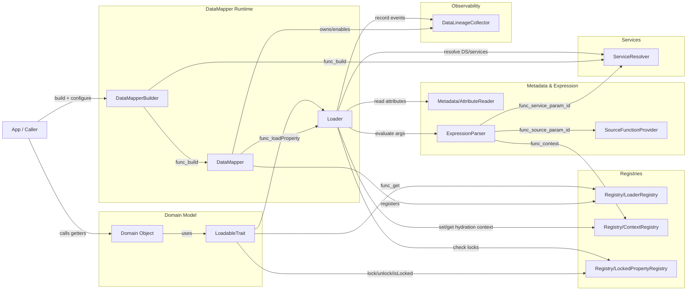

# Composants principaux — Vue C4-like (Mermaid)

Cette vue reprend **exactement les mêmes composants** que la vue précédente, mais les organise en "boundaries" (groupes) pour se rapprocher d’une lecture C4 (Contexte/Conteneurs/Composants) tout en restant en Mermaid standard.

## Diagramme (C4-like en `flowchart`)

## Lecture rapide (où regarder)
- **Domain Model** : ne dépend pas directement du Loader concret; passe par `LoaderRegistry`.
- **DataMapper Runtime** : construit/branche le Loader et expose la façade `DataMapper`.
- **Registries** : état global volontairement minimal (Loader courant, context, locks).
- **Metadata & Expression** : lecture des attributs + évaluation des expressions/arguments.
- **Observability** : collecte d’événements, activable/désactivable.
