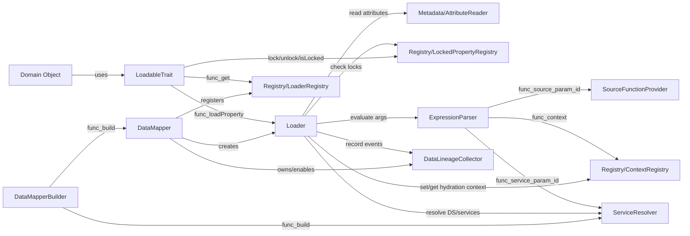

# Composants principaux — DataMapper (Mermaid)

## Rôles
- **DataMapperBuilder** : assemble la résolution de services et construit le runtime.
- **DataMapper** : façade; instancie le `Loader`, gère contexte applicatif + lineage.
- **Loader** : exécute l’hydratation (lazy/eager), applique règles, hooks, contexte.
- **AttributeReader** : lit les attributs PHP (métadonnées) via Reflection.
- **ServiceResolver** : résout une DataSource/service (PSR-11, locators, factories…).
- **ExpressionParser** : évalue `expr(...)`, `context(...)`, `source('id')`, `service('id')`.
- **SourceFunctionProvider** : exécute (et optionnellement cache) `source('id')`.
- **Registries** : état global minimal (Loader, Context, Locked properties).
- **LoadableTrait** : côté domaine; déclenche le lazy-load en appelant le Loader global.
- **DataLineageCollector** : collecte d’événements (si activée).

## Explication des liens
- **DataMapperBuilder → ServiceResolver** : construit la stratégie de résolution (container/locators/factories).
- **DataMapperBuilder → DataMapper** : crée le runtime qui orchestre le reste.
- **DataMapper → Loader** : instancie le cœur d’exécution (avec logger/cache/collector).
- **DataMapper → LoaderRegistry** : enregistre le Loader global pour que les objets métiers puissent déclencher des chargements sans dépendance directe.
- **LoadableTrait → LoaderRegistry** : récupère le Loader actif pour appeler `loadProperty(...)`.
- **LoadableTrait → LockedPropertyRegistry** : verrouille/déverrouille des propriétés pour empêcher l’écrasement par hydratation.
- **Loader → AttributeReader** : lit `DataSourceRef`, `Context`, `Needs`, hooks… pour décider comment hydrater.
- **Loader → ServiceResolver** : obtient l’instance de DataSource/service à exécuter.
- **Loader → ExpressionParser** : résout les arguments dynamiques (références propriétés, contexte, sources, services).
- **ExpressionParser → ContextRegistry** : lit le contexte (applicatif + hydratation) utilisé dans les expressions.
- **ExpressionParser → SourceFunctionProvider** : exécute/récupère le résultat `source('id')`.
- **ExpressionParser → ServiceResolver** : résout `service('id')` lorsqu’une expression le demande.
- **Loader → ContextRegistry** : écrit le contexte d’hydratation issu des attributs `#[Context]`.
- **Loader → LockedPropertyRegistry** : vérifie le verrouillage avant toute hydratation (skip si verrouillé).
- **Loader → DataLineageCollector** : enregistre les événements (calls DataSource, hydrations, skips…) si la collecte est activée.

## Diagramme Mermaid

