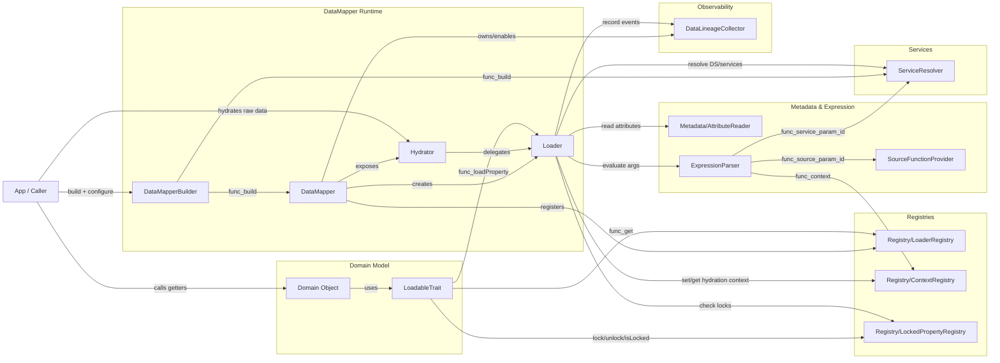

# Main Components — C4-like View (Mermaid)

This view shows **the exact same components** as the previous view, but organizes them into "boundaries" (groups) to make it closer to a C4-style reading (Context/Containers/Components) while staying in standard Mermaid.

## Diagram (C4-like using `flowchart`)

## Quick Reading (where to look)
- **Domain Model**: does not depend directly on the concrete Loader; it goes through `LoaderRegistry`.
- **DataMapper Runtime**: wires the Loader and exposes the `DataMapper` facade.
- **Hydrator**: user-facing API to hydrate objects from raw data; delegates to `Loader`.
- **Hydrator**: user-facing API to hydrate objects from raw data (obtained via `DataMapper::getHydrator()`); delegates to `Loader`.
- **Registries**: intentionally minimal global state (current Loader, context, locks).
- **Metadata & Expression**: attribute reading + expression/argument evaluation.
- **Observability**: event collection, can be enabled/disabled.
