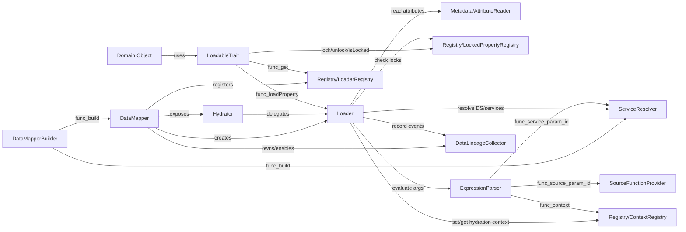

# Main Components — DataMapper (Mermaid)

## Roles
- **DataMapperBuilder**: assembles service resolution and builds the runtime.
- **DataMapper**: facade; instantiates the `Loader`, manages application context + lineage, and exposes a `Hydrator`.
- **Hydrator**: user-facing hydration API (obtained via `DataMapper::getHydrator()`); instantiates objects and hydrates them from raw data.
- **Loader**: executes hydration (lazy/eager), applies rules, hooks, and context.
- **AttributeReader**: reads PHP attributes (metadata) via Reflection.
- **ServiceResolver**: resolves a DataSource/service (PSR-11, locators, factories…).
- **ExpressionParser**: evaluates `expr(...)`, `context(...)`, `source('id')`, `service('id')`.
- **SourceFunctionProvider**: executes (and optionally caches) `source('id')`.
- **Registries**: minimal global state (Loader, Context, Locked properties).
- **LoadableTrait**: domain-side; triggers lazy-load by calling the global Loader.
- **DataLineageCollector**: event collection (when enabled).

## Link Explanations
- **DataMapperBuilder → ServiceResolver**: builds the resolution strategy (container/locators/factories).
- **DataMapperBuilder → DataMapper**: creates the runtime that orchestrates the rest.
- **DataMapper → Loader**: instantiates the execution core (with logger/cache/collector).
- **DataMapper → Hydrator**: exposes a dedicated hydration API for turning raw data into objects.
- **Hydrator → Loader**: delegates the actual hydration work to the Loader (instantiation, hooks, property setting).
- **DataMapper → LoaderRegistry**: registers the global Loader so domain objects can trigger loads without a direct dependency.
- **LoadableTrait → LoaderRegistry**: retrieves the active Loader to call `loadProperty(...)`.
- **LoadableTrait → LockedPropertyRegistry**: locks/unlocks properties to prevent being overwritten by hydration.
- **Loader → AttributeReader**: reads `DataSourceRef`, `Context`, `Needs`, hooks… to decide how to hydrate.
- **Loader → ServiceResolver**: obtains the DataSource/service instance to execute.
- **Loader → ExpressionParser**: resolves dynamic arguments (property references, context, sources, services).
- **ExpressionParser → ContextRegistry**: reads context (application + hydration) used in expressions.
- **ExpressionParser → SourceFunctionProvider**: executes/returns the result of `source('id')`.
- **ExpressionParser → ServiceResolver**: resolves `service('id')` when requested by an expression.
- **Loader → ContextRegistry**: writes hydration context coming from `#[Context]` attributes.
- **Loader → LockedPropertyRegistry**: checks locking before any hydration (skip if locked).
- **Loader → DataLineageCollector**: records events (DataSource calls, hydrations, skips…) when collection is enabled.

## Mermaid Diagram

